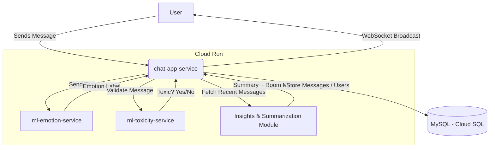

# 📘 Real-Time Affective Chatroom with AI Moderation

## 🧩 Problem Statement

Digital communication often loses the subtle emotional cues present in face-to-face conversation. Most chat platforms treat messages as plain text, which:

* Makes conversations feel impersonal.
* Leads to misunderstandings due to missing emotional context.
* Overwhelms users in active group chats because they cannot quickly gauge the tone or catch up.

Online communities additionally battle **toxicity**, which requires manual moderation—slow, reactive, and mentally exhausting.

This project solves all three challenges by enabling AI-powered emotional understanding, automatic moderation, and intelligent summarization.

---

## 🎯 Why This Solution?

The goal was to build a chat system that:

* Understands emotional tone in real-time.
* Protects users with proactive toxicity detection.
* Scales efficiently without lag.

A **microservices architecture** was essential. Running LLMs and Transformer models inside a monolithic real-time app introduces:

* Memory bottlenecks
* High latency
* Frequent crashes

By splitting the system into lightweight orchestrators and dedicated AI workers, we achieve:

* High scalability
* Stable memory consumption
* Zero-latency messaging with asynchronous updates

---

## 🏗️ What's the Overall Architecture?

### 🔄 Workflow Overview

The system uses a **Broadcast-First, Update-Later** asynchronous pipeline:

1. User sends message → instantly broadcast to chat participants.
2. Message is routed to AI microservices for emotion detection.
3. Clients receive an update replacing the placeholder with an emotion emoji.
4. Toxic content is intercepted BEFORE broadcast using blocking validation.

---
### 🗺️ Mermaid Architecture Diagram

---

## 🧠 System Components

### **1. Chat Application Service (`chat-app-service`)**

**Purpose:** Real-time communication orchestrator.

**Responsibilities:**

* Maintains persistent WebSocket connections.
* Handles user authentication via JWT.
* Stores messages in MySQL using SQLAlchemy.
* Serves the frontend UI.
* Routes messages to AI microservices.

**Key Features:**

* Custom `ConnectionManager` for multi-user broadcasts.
* Async processing using Python's `asyncio`.

**Input:** Raw text messages.
**Output:** JSON message payloads with incremental updates.

---

### **2. Emotion Analysis Service (`ml-emotion-service`)**

**Role:** Detects emotional tone of each message.

**Model:** `modernbert-base-go-emotions` (27-label classifier with high F1 performance).

**Behavior:**

* Receives text.
* Predicts dominant emotion (joy, fear, admiration, etc.).

**Input:** Text message.
**Output:** JSON object `{ "emotion": "joy" }`.

---

### **3. Content Moderation Service (`ml-toxicity-service`)**

**Role:** Blocks harmful or toxic messages.

**Model:** `roberta_toxicity_classifier`.

**Logic:**

* Computes toxicity probability.
* If score > threshold → message blocked.

**Input:** Message text.
**Output:** `{ "is_toxic": true, "score": 0.98 }`.

---

### **4. Insights & Summarization Module**

**Role:** Helps users catch up with high-level room insights.

**Tools:** Google Gemini 1.5 Flash via LangChain.

**Behavior:**

* Collects last 30–50 messages.
* Produces summaries and “room mood” sentiment.

---

## 💬 Demo

**System:** User "Alice" joins the chat.
**System:** User "Bob" is online.

**Alice:** "I finally got the promotion I've been working for!"

* Displayed instantly → `💬`
* Emotion module returns `joy` → System updates message → `🤩`

**Bob:** "That is absolutely fantastic news, congrats!"

* Emotion detected → `😍`

**Malicious User:** "You are a complete idiot."

* Toxicity score = 0.98 → Message blocked.
* System privately warns user: "⚠️ Message blocked for toxicity (1/3)."

**Alice clicks "Get Summary" →**
System returns:

> **Summary:** Alice celebrated a job promotion. Bob congratulated her. Overall mood: **joyful**.

---

## 🛠️ The Build

### **Languages & Frameworks**

* **Backend:** Python 3.10, FastAPI
* **Frontend:** JavaScript (ES6), Tailwind CSS

### **Key Libraries:**

* `transformers`, `torch` (Hugging Face + PyTorch)
* `langchain-google-genai`
* `sqlalchemy`
* `uvicorn`, `httpx`

### **Infrastructure:**

* **Google Cloud Run:** Containerized serverless deployment
* **Google Cloud SQL (MySQL):** Persistent storage
* **Docker:** Reproducible builds

### **Optimizations:**

* Async `asyncio.create_task` for background inference
* Gunicorn (1 worker) to minimize memory usage
* Secure Cloud SQL connections with authorized networks

---

## 🚀 If I Had More Time…

* **Multimodal Emotion Detection:** Emotion from voice using Wav2Vec.
* **Mobile App:** React Native or Flutter client.
* **End-to-End Encryption:** Add client-side encrypted chat.
* **Moderator Dashboard:** Track mood trends, toxicity spikes.
* **Personalized AI Settings:** Adjust sensitivity for emotions and toxicity.

---

